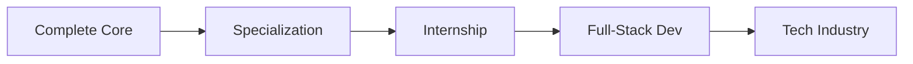

# 🚀 My 42 School Journey | Becoming a Full-Stack Developer

<div align="center">
  


### 💫 *"The journey of a thousand miles begins with a single step"*

</div>

---

## 🌟 About This Repository

Welcome to my **42 School adventure**! This repository is a living documentation of my transformation from curious learner to full-stack software developer. Here you'll find all my projects, learnings, and the evolution of my coding skills through the innovative 42 curriculum.

<div align="center">

```ascii
    🎯 MISSION: Master Full-Stack Development
    📚 METHOD: Peer-to-Peer Learning
    🔥 MINDSET: No Teachers, Just Discovery
```

</div>

---

## 🎨 My Developer Journey

<div align="center">

| Phase | Focus Area | Status | Skills Gained |
|-------|------------|--------|---------------|
| 🌱 **Piscine** | Fundamentals | ✅ Complete | C Programming, Shell, Git |
| 🔧 **Common Core** | System Programming | 🔄 In Progress | Algorithms, Data Structures |
| 🎯 **Specialization** | Full-Stack Dev | ⏳ Coming Soon | Web Technologies |
| 🚀 **Internship** | Real World | 📅 Future | Professional Experience |

</div>

---

## 📂 Project Portfolio

### 🥇 Core Projects

<table>
<tr>
<td width="50%">

#### 🛠️ **System & Algorithms**
- **[Libft](./libft)** - Custom C Library
  
- **[Printf](./ft_printf)** - Printf Recreation
  
- **[Get Next Line](./get_next_line)** - File Reading
  
- **[Push Swap](./push_swap)** - Sorting Algorithm
  
- **[Pipex](./pipex)** - Shell Pipe Recreation
  

#### 🎮 **Graphics & Multimedia**
- **[FdF](./fdf)** - 3D Wireframe Renderer
  
  
- **[Cub3D](./cub3d)** - Raycasting Game Engine
  
  

</td>
<td width="50%">

#### 🧠 **Concurrency & System Programming**
- **[Philosophers](./philosophers)** - Threading & Synchronization
  
  
- **[Minishell](./minishell)** - Custom Shell Implementation
  
  

#### 🌐 **Web Development & Advanced**
- **[CPP Modules](./cpp_modules)** - Object-Oriented Programming
  
  
- **[Webserv](./webserv)** - HTTP Server
  
- **[Transcendence](./transcendence)** - Full-Stack Web App
  
  
- **[Inception](./inception)** - Docker Infrastructure
  

</td>
</tr>
</table>

---

## 💻 Tech Stack Evolution

<div align="center">

### 🔥 Current Arsenal


### 🛠️ Tools & Technologies


</div>

---

## 📊 Progress Tracking

<div align="center">

### 🎯 42 Cursus Progress

```
Level: [████████░░] 80% Complete
```

**Current Level:** 5.88%
**Projects Completed:** 20/23    

### 📈 Skills Development

| Skill | Proficiency | Projects |
|-------|-------------|----------|
| **C Programming** | ████████░░ 80% | Libft, Printf, Push_swap, Pipex |
| **Graphics Programming** | ████████░░ 80% | FdF, Cub3D |
| **Threading & Concurrency** | ███████░░░ 70% | Philosophers |
| **System Programming** | █████████░ 90% | Minishell, Pipex |
| **Object-Oriented (C++)** | ████████░░ 80% | CPP Modules |
| **Web Development** | █████░░░░░ 50% | Webserv, Transcendence |
| **DevOps** | ███████░░░ 70% | Inception, Born2beroot |

</div>

---

## 🌈 Learning Philosophy

<div align="center">

> ### 🎓 "At 42, we don't just learn to code - we learn to learn and to think like developers"

</div>

### 🔑 Key Principles I've Embraced:

- **🤝 Peer Learning**: Collaborating and learning from fellow students
- **🔍 Problem Solving**: Breaking down complex problems into manageable pieces
- **📚 Self-Directed Learning**: Taking ownership of my educational journey
- **🛠️ Hands-On Practice**: Learning by building real projects
- **🔄 Iterative Improvement**: Constantly refining and optimizing code

---

## 🎯 Future Goals

<div align="center">

### 🚀 **Next Milestones**



</div>

- 🎯 **Short Term**: Complete remaining core projects
- 🌐 **Medium Term**: Master full-stack web development
- 🚀 **Long Term**: Land a software engineering role
- 💡 **Dream**: Contribute to open-source projects and mentor others

---

## 📞 Let's Connect!

<div align="center">

[](https://www.linkedin.com/in/valentinogs/)
[](https://github.com/ValGSgit)
[](https://profile.intra.42.fr/users/vagarcia)
[](mailto:entinosusini@gmail.com)

---

### 💭 *"The best way to predict the future is to create it"*

**⭐ If you find my journey interesting, please give this repo a star!**

*Last Updated: September 2025*

</div>
